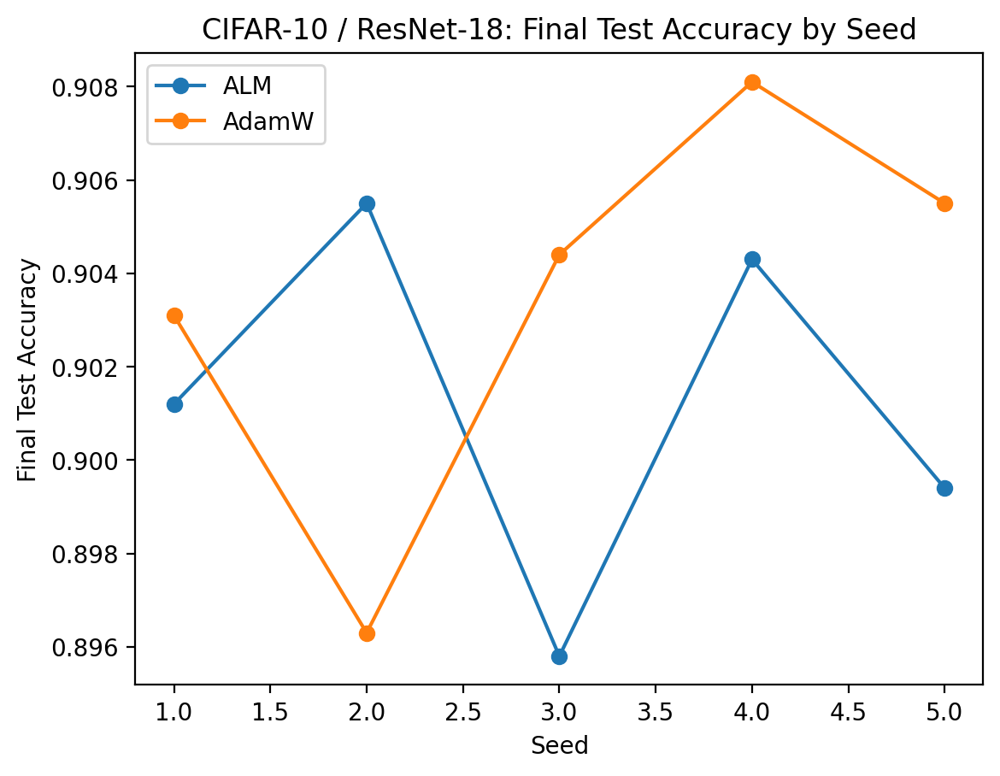
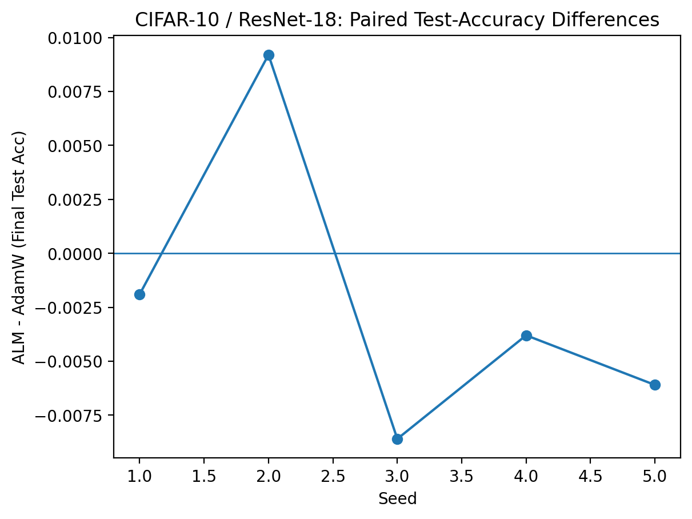

# ALM Optimizer Bench
**KKT-guided Augmented Lagrangian constrained training on top of AdamW (image classification).**

This repository contains a **from-scratch** implementation of a practical **Augmented Lagrangian Method (ALM)** controller integrated into modern deep-learning training (**PyTorch + AMP**). The goal is to translate constrained optimization theory (**KKT / ALM**) into a **plug-and-play training mechanism** that can enforce a **global inequality constraint** during deep network optimization while remaining **baseline-competitive**.

**Source of truth:** `notebooks/alm_experiments.ipynb`  
**Exported code (auto-generated):** `src/alm_experiments.py`  
**Paper-ready artifacts:** `results/tables/*`, `results/figures/*`

---

## What this is
We study empirical risk minimization with an additional inequality constraint (a “budget” over a global statistic). We implement a **stochastic ALM wrapper** that:

1) augments the primal gradient with dual/penalty terms (optimized with AdamW),  
2) updates the dual variable with **projected ascent** under a stability-oriented design (EMA smoothing + clipping),  
3) adapts the penalty weight with **bounded growth/shrink** to remain stable under stochastic gradients.

This is an **early-stage research system**, but it already demonstrates stable constrained-training behavior with controller diagnostics (`logK`, `B`, `g_ema`, `lam`, `rho`) and **baseline-competitive accuracy** under paired-seed evaluation.

---

## 1) Constrained learning formulation
We consider:
$$
\min_{\theta \in \mathbb{R}^d} f(\theta)
\quad \text{s.t.} \quad g(\theta) \le 0,
$$
where:
- $f(\theta)$ is the standard training objective (cross-entropy + weight decay),
- $g(\theta)$ is a scalar constraint measuring a global model/training statistic.

### Budget instantiation used in this benchmark
We use a log-budget surrogate:
$$
g(\theta) = \log K(\theta) - B,
$$
where $B$ is the chosen budget (in log-space). The implementation logs:
- `logK` (constraint statistic),
- `B` (target budget),
- `g_ema` (EMA-smoothed violation),
- controller state (`lam`, `rho`).

> The ALM machinery is agnostic to the specific definition of $K(\theta)$ as long as it is differentiable / autograd-friendly.

---

## 2) KKT connection and ALM objective
For inequality constraints, the KKT conditions (informally) require:
- **primal feasibility:** $g(\theta^\star)\le 0$,
- **dual feasibility:** $\lambda^\star \ge 0$,
- **complementary slackness:** $\lambda^\star g(\theta^\star)=0$,
- **stationarity:** $\nabla f(\theta^\star) + \lambda^\star \nabla g(\theta^\star)=0$.

We implement an augmented Lagrangian:
$$
\mathcal{L}_A(\theta,\lambda,\rho)
= f(\theta) + \lambda\,g(\theta) + \frac{\rho}{2}\,[g(\theta)]_+^2,
\quad \lambda\ge 0,\ \rho>0,
$$
where $[x]_+ = \max(x,0)$.

---

## 3) Practical stochastic updates (what the code does)
Deep nets are stochastic and non-convex, so the implementation uses a practical stochastic ALM variant:
- minibatch gradients for $f$,
- periodic/controlled evaluation of $g(\theta)$,
- EMA smoothing for constraint signals,
- bounded $\rho$ control + projected dual ascent for stability.

**Primal step (AdamW on augmented gradient):**
$$
\theta_{t+1} = \mathrm{AdamW}\!\left(\theta_t,\;
\nabla f(\theta_t)
+ \lambda_t \nabla g(\theta_t)
+ \rho_t [g(\theta_t)]_+\, \nabla g(\theta_t)
\right).
$$

**Dual ascent (projected + smoothed):**
$$
\lambda_{t+1} =
\Pi_{[0,\lambda_{\max}]}\!\left(\lambda_t + \alpha\, \tilde g_t\right),
\qquad
\tilde g_t = \beta \tilde g_{t-1} + (1-\beta) g(\theta_t).
$$

**Penalty control (bounded):**
$$
\rho \leftarrow \mathrm{clip}(\rho,\rho_{\min},\rho_{\max}),
$$
with an adaptive schedule that increases penalty under persistent violation and relaxes under sustained feasibility (see the notebook for details and logging behavior).

---

## 4) Repository contents

### Code
- Notebook (source of truth): `notebooks/alm_experiments.ipynb`
- Exported script (generated from notebook; for review/searchability): `src/alm_experiments.py`

### Results (paper-ready artifacts)
- Tables:
  - `results/tables/c10_r18_paired_seed_results.csv`
  - `results/tables/c10_r18_stats.txt`
  - `results/tables/c10_r18_stats_recomputed.txt`
- Figures:
  - `results/figures/c10_r18_test_acc_by_seed.png`
  - `results/figures/c10_r18_paired_diff.png`

### Utilities
- `scripts/make_plots.py` (generate figures from CSV)
- `scripts/recompute_stats.py` (bootstrap CI + paired permutation test)
- `scripts/export_notebook_to_src.bat` (Windows notebook export helper)
- `scripts/export_notebook_to_src.sh` (Linux/macOS export helper)

---

## 5) CIFAR-10 / ResNet-18 (paired-seed evaluation)
We run **paired seeds** (same seeds for AdamW and ALM-on-AdamW) and report:
- `final_test_acc` (end of training),
- `best_val_acc`,
- `test_at_best_val` (test at the epoch of best validation).

Raw paired table:
- `results/tables/c10_r18_paired_seed_results.csv`

Summary statistics (paired bootstrap CI + paired permutation test):
- `results/tables/c10_r18_stats.txt` (original run output)
- `results/tables/c10_r18_stats_recomputed.txt` (recomputed from CSV)

Figures (already committed):
- Per-seed test accuracy:  
  
- Paired differences (ALM minus AdamW):  
  

### Research framing
At this stage, the primary result is an end-to-end ALM/KKT-inspired controller that:
- remains stable under stochastic training,
- exposes interpretable control signals (`logK`, `B`, `g_ema`, `lam`, `rho`),
- runs in a regime that is already close to strong baselines under paired-seed evaluation.

This establishes a base to scale toward broader benchmarks and pursue gains via:
- stronger baseline recipes and schedules,
- alternative constraint families (task-aligned / generalization-aligned),
- controller ablations (dual step size, EMA smoothing, penalty schedule, constraint frequency),
- multi-dataset / multi-architecture coverage.

---

## 6) Reproducibility

### Install (Windows + Git Bash)
```bash
python -m venv .venv
source .venv/Scripts/activate
python -m pip install -r requirements.txt


